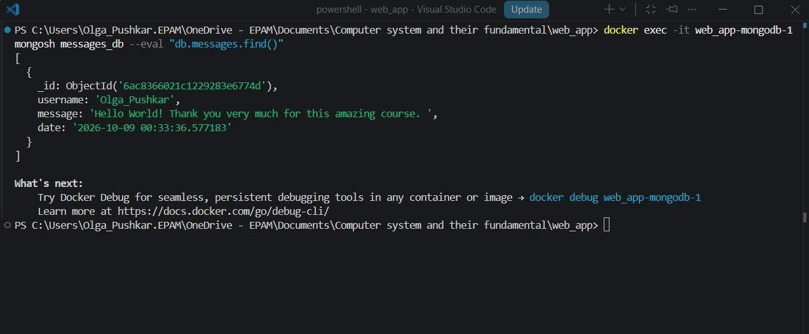

# Фінальний проєкт: Веб-застосунок з архітектурою HTTP + UDP Socket та збереженням у MongoDB

Цей проєкт реалізує клієнт-серверний веб-застосунок на мові Python, який використовує стандартні модулі для побудови HTTP та UDP серверів у різних паралельних процесах. Всі дані з форми збираються, передаються через сокети та надійно зберігаються у базі даних MongoDB. Проєкт повністю контейнеризовано за допомогою Docker та Docker Compose.

## 🛠️ Функціонал та архітектура проєкту

1. **HTTP Server (порт 3000):** 
   - Обробляє GET-запити: віддає статичні сторінки сайту (`index.html`, `message.html`), а також стилі (`style.css`) та зображення.
   - Обробляє POST-запити: приймає дані з форми зворотного зв'язку на маршруті `/message` та пересилає їх через UDP-протокол на Socket-сервер.
   - У випадку запиту неіснуючих сторінок повертає кастомну сторінку `error.html` зі статусом 404.

2. **Socket Server (порт 5000):**
   - Працює за UDP-протоколом в окремому ізольованому процесі (`multiprocessing`).
   - Приймає JSON-пакети з даними від HTTP-сервера.
   - Додає до кожного повідомлення точний час отримання (`date`) та записує документ у базу даних.

3. **База даних MongoDB:**
   - Працює в окремому офіційному Docker-контейнері.
   - Дані зберігаються у колекції `messages` бази даних `messages_db`.
   - Налаштовано Docker Volumes для персистентного (постійного) збереження даних навіть після повної зупинки або перезапуску контейнерів.

---

## 🚀 Інструкція із запуску застосунку

### 1. Передумови
Переконайтеся, що на вашому комп'ютері встановлено та запущено **Docker Desktop**.

### 2. Запуск контейнерів
Відкрийте термінал у кореневій папці проєкту та виконайте команду для автоматичного завантаження образів, збірки додатка та запуску сервісів:

```bash
docker-compose up --build
```

Після успішного підняття контейнерів веб-сайт стане доступним за адресою: [http://localhost:3000](http://localhost:3000).

---

## 📸 Демонстрація роботи програми (Результати тестування)

### 1. Головна сторінка веб-сайту
При переході на `http://localhost:3000` успішно завантажується головна сторінка проєкту із повним збереженням стилів (`style.css`) та графічних елементів:


### 2. Форма відправки повідомлень (Send message)
Сторінка форми (`http://localhost:3000/message.html`) приймає нікнейм користувача та текст повідомлення. Після натискання кнопки "Send" дані успішно кодуються та відправляються через UDP-сокет:


### 3. Перевірка збереження даних в MongoDB
Для верифікації запису даних виконано підключення безпосередньо всередину контейнера бази даних за допомогою вбудованої утиліти `mongosh`. Результат виконання команди `db.messages.find()` підтверджує успішну доставку та збереження документа разом із автоматичною міткою часу:




---

## 🗂️ Структура фірмових файлів проєкту

```text
web_app/
│
├── front-init/            # Статичні ресурси сайту
│   ├── index.html         # Головна сторінка
│   ├── message.html       # Сторінка форми зворотного зв'язку
│   ├── error.html         # Кастомна сторінка помилки 404
│   ├── style.css          # Таблиця стилів сайту
│   └── logo.png           # Логотип компанії
│
├── main.py                # Основний скрипт (HTTP та UDP сервери в multiprocessing)
├── requirements.txt       # Залежності проєкту (pymongo)
├── Dockerfile             # Інструкції збірки контейнера для Python-застосунку
└── docker-compose.yaml    # Сценарій багатоконтейнерного розгортання додатка та бази
```


